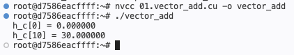

# 01 - CUDA Vector Addition

## Purpose

Implemented a basic CUDA vector addition kernel to understand:

- CUDA kernel execution flow
- thread indexing
- host/device memory allocation
- CPU ↔ GPU memory transfer
- kernel launch configuration
- synchronization flow

---

## Kernel Logic

Each GPU thread computes one element of the output vector.

```cpp
int i = blockIdx.x * blockDim.x + threadIdx.x;

if (i < n) {
    c[i] = a[i] + b[i];
}
```

---

## CUDA Execution Flow

```text
Host memory allocation
→ Initialize host data
→ Device memory allocation
→ Copy host → device
→ Launch kernel
→ Synchronize
→ Copy device → host
→ Free memory
```
---

## Execution Environment

| Component | Details |
|---|---|
| GPU | NVIDIA L4 |
| NVIDIA Driver Version | 580.126.20 |
| CUDA Runtime Version | 13.0 |
| NVCC Version | CUDA 12.6 (V12.6.77) |
| Operating Environment | Lightning AI GPU Instance |

---

## Output

```text
h_c[0] = 0.000000
h_c[10] = 30.000000
```

## Learning Notes

- Each GPU thread computes one element.
- GPU memory is separate from CPU memory.
- `cudaMemcpy` transfers data between CPU and GPU.
- `cudaDeviceSynchronize()` ensures GPU execution completes before CPU continues.
