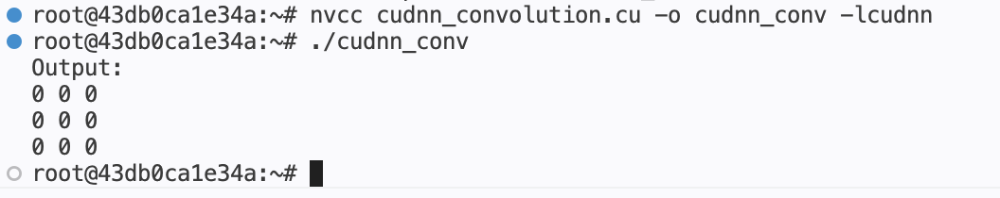

# 04 - cuDNN Convolution

## Purpose

Implemented convolution using NVIDIA cuDNN library to understand:

- cuDNN tensor workflow
- Descriptor-based deep learning execution
- Tensor descriptors
- Filter descriptors
- Convolution descriptors
- Host ↔ Device tensor flow
- Convolution algorithm selection
- Workspace allocation
- Relationship between convolution and GEMM-style execution
- Difference between handwritten CUDA kernels and optimized deep learning libraries

---

## Convolution Formula

Convolution performs:

```text
element-wise multiplication + accumulation
```

while sliding filters across input tensors.

For this implementation:

- Input Tensor Shape = 1 × 1 × 5 × 5
- Filter Shape = 1 × 1 × 3 × 3
- Padding = 0
- Stride = 1
- Dilation = 1

Output Tensor Shape:

```text
((H - K + 2P) / S) + 1
```

which becomes:

```text
((5 - 3 + 2(0)) / 1) + 1 = 3
```

Final Output Shape:

```text
1 × 1 × 3 × 3
```

---

## CUDA/cuDNN Execution Flow

Describe tensors → Describe filters → Configure convolution rules → Allocate GPU memory → Host → Device tensor copy → Select convolution algorithm → Allocate workspace → Execute convolution → Device → Host copy → Print output → Cleanup resources

---

## Execution Environment

| Component | Details |
|---|---|
| GPU | NVIDIA L4 |
| NVIDIA Driver Version | 580.126.20 |
| CUDA Runtime Version | 13.0 |
| NVCC Version | CUDA 12.6 |
| Operating Environment | Lightning AI GPU Instance |

---

## Compilation

```bash
nvcc cudnn_convolution.cu -o cudnn_conv -lcudnn
./cudnn_conv
```

```text
-lcudnn --> link cuDNN library
```

---

## Output

```text
Output:
0 0 0
0 0 0
0 0 0
```

---

## GPU Execution



---

## Key Learning Notes

- cuDNN uses descriptor-based tensor configuration.
- Input, filter, and output tensors are represented using tensor descriptors.
- Convolution descriptors configure padding, stride, and dilation rules.
- cuDNN internally executes optimized convolution kernels.
- Convolution is fundamentally repeated local matrix multiplication and accumulation.
- Modern convolution implementations internally map into GEMM-like execution paths.
- Workspace memory is used for optimized convolution execution algorithms.
- cuDNN abstracts low-level CUDA convolution optimizations from developers.
- CUDA memory management flow remains similar even when using deep learning libraries.
